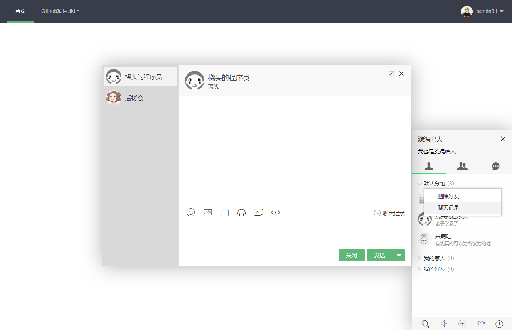
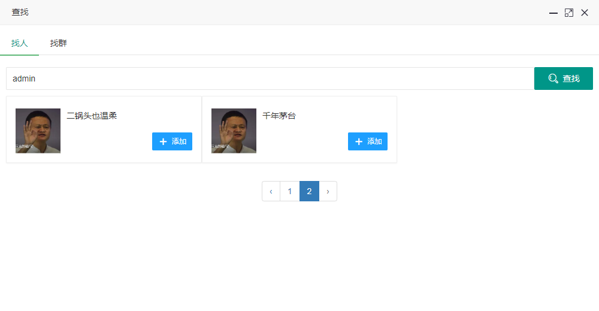
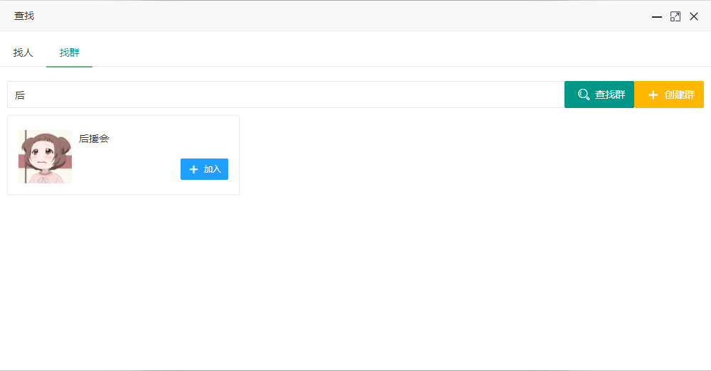
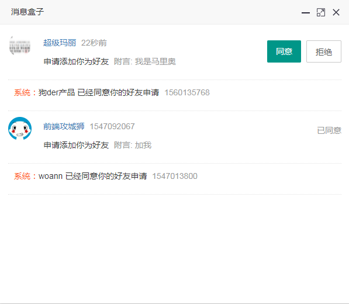

# Gatewaywork + laravel5.5 + Layim实现聊天系统

## 概述
基于workerman的GatewayWorker框架开发的一款高性能支持分布式部署的聊天接口。<br>
基于laravel的TLS版本5.5实现http请求<br>
基于layim实现前端数据渲染<br>

GatewayWorker框架文档：[http://www.workerman.net/gatewaydoc/](http://www.workerman.net/gatewaydoc/])<br>
laravel5.5框架文档：[https://laravelacademy.org/laravel-docs-5_5](https://laravelacademy.org/laravel-docs-5_5])<br>
Layim框架文档：[https://www.layui.com/doc/modules/layim.html](https://www.layui.com/doc/modules/layim.html)

## 版本支持

> PHP >=7.1<br>
> GatewayWorker 3.0.12<br>
> layui 2.4.5

## 功能列表
|功能|描述|
|----------|-------------|
|登录 | 用户登陆|
|注册 | 注册过程中为用户分配了一个默认分组，并将用户添加到所有人都在的一个群（用于日后推送公告信息）|
|查找-好友 | 可以根据用户名、昵称、id来查找，不输入内容不允许查找数据，点击发起好友申请，每页6人|
|查找-群聊 | 可根据群昵称、群id查找群聊，点击加入，每页6人|
|创建群聊 | 创建一个新群聊|
|修改群聊名称 | 修改指定群聊名称|
|解散群聊 | 解散指定群聊分组|
|面板内快速查找 | 查找已加的好友（好友列）、群聊（群聊列）|
|消息盒子 | 用来接受好友请求和同意或拒绝好友请求的系统消息|
|个性签名 | 如果客服系统可显示客户访问商品ID和商品，如果聊天可以显示发表心情|
|一对一聊天 | 可发送文字、表情、图片、文件、音乐链接、视频链接、代码等|
|群聊 | 新成员加入群聊时，如果此刻你正开启着该群对话框，将收到新人入群通知|
|查看群成员|查看群聊中所有成员|
|临时会话 | 在群成员中，点击群成员头像即可发起临时会话|
|历史记录 | 聊天面板只显示20条记录，更多记录点击聊天记录查看|
|离线消息 | 对方不在线的时候，向对方发起好友请求或者消息，将在对方上线后第一时间推送|
|换肤 | 这个是layim自带的东西|
|删除好友|好友列表右击删除好友|
|查看聊天记录|好友列表右击查看聊天记录或者打开聊天窗口点击聊天记录|
|删除好友分组|右击好友分组可将好友分组删除|
|新增好友分组|右击好友分组可新增好友分组|
|重命名好友分组|右击好友分组可重命名改分组|

## 安装
1. 下载项目
```
git clone https://github.com/cuigeg/workman.git
```
2.项目根目录复制.env文件
```
cp .env.example .env
```
3.composer安装依赖
```
composer insatll
```
4.生成独立的Key
```
php artisan key:generate
```
5.配置数据<br>
5.1 .env文件
```
DB_CONNECTION=mysql
DB_HOST=127.0.0.1
DB_PORT=3306
DB_DATABASE=im
DB_USERNAME=homestead
DB_PASSWORD=secret
DB_PREFIX=im_
```
5.2 /Applications/YourApp/Config/Db.php
```
<?php
namespace Config;
/**
 * mysql配置
 * @author walkor
 */
class Db
{
    /**
     * 数据库配置
     */
    public static $homestead = array(
        'host' => '192.168.10.10',
        'port' => '3306',
        'dbname' => 'im',
        'user' => 'homestead',
        'password' => 'secret',
        'charset'  => 'utf8',
    );
}
```
6.项目根目录运行Gateway
```
php start.php start
```
7.访问laravel项目，查看是否运行正常

## 更改源码Layim
1.好友列表右击事件（删除好友，聊天记录）<br>
2.好友分组右击事件（重命名分组，删除分组，新增分组）<br>
3.群聊右击事件（创建群聊，修改群聊名称，删除群聊）
```
//好友列表右击事件（好友分组雷同）
x.find(".layim-list-friend  .layui-layim-list").on("contextmenu", "li",
    function(a) {
        var n = e(this),
        l = '<ul data-id="' + n.attr('class').split(' ').shift() + '" data-index="' + n.data("index") + '" data-name="'+ n.find('span')[0].innerText +'"  data-type="'+ n.data('type') +'"><li layim-event="menuList" data-type="one">删除好友</li><li layim-event="chatLog1" data-type="all">聊天记录</li></ul>';
        n.hasClass("layim-null") || (t.tips(l, this, {
            tips: 1,
            time: 0,
            anim: 5,
            fixed: !0,
            skin: "layui-box layui-layim-contextmenu",
            success: function(i) {
                var a = function(i) {
                    ii(i)
                };
                i.off("mousedown", a).on("mousedown", a);
                let top = n.offset().top;
                let left = n.offset().left;
                top -=  i[0].offsetHeight;
                i.css({'left':left + 'px','top':top + 'px'});
            }
        }), e(document).off("mousedown", i).on("mousedown", i), e(window).off("resize", i).on("resize", i))
        //防止冒泡事件
        return false;
    })
    
    //删除好友
    menuList:function(){
        ...
    }
    
    //查看聊天记录
    chatLog1:function(){
        ...
    }
```
## 页面展示
1.好友聊天<br>

2.群聊<br>

3.查找好友<br>

4.查找群聊<br>

5.消息盒子<br>

## 声明
1. 前端部分是采用layui,在此郑重说明，layui中的im部分layim并不开源，仅供交流学习，请勿将此项目中的layim用作商业用途
2. 此项目持续开发中，欢迎有兴趣的朋友共同维护
3. 此项目属于个人项目，如果有兴趣的小伙伴可以一起贡献代码
感觉还不错的小伙伴，请留下您的star


